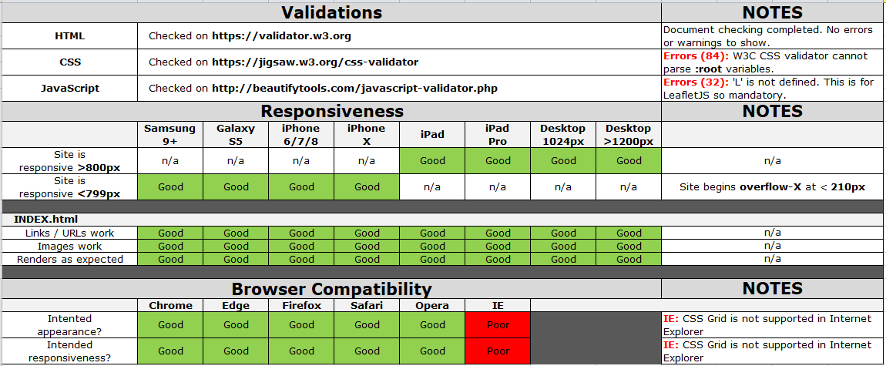
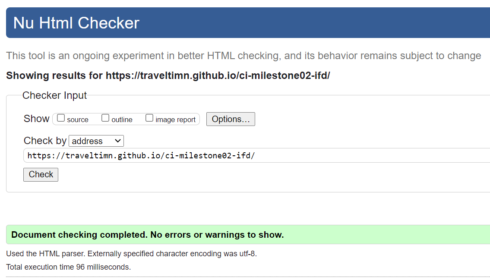
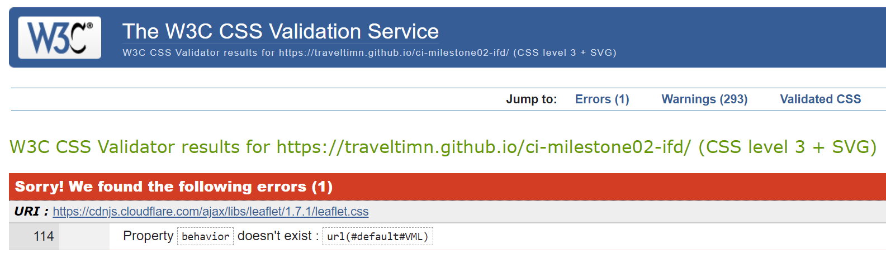
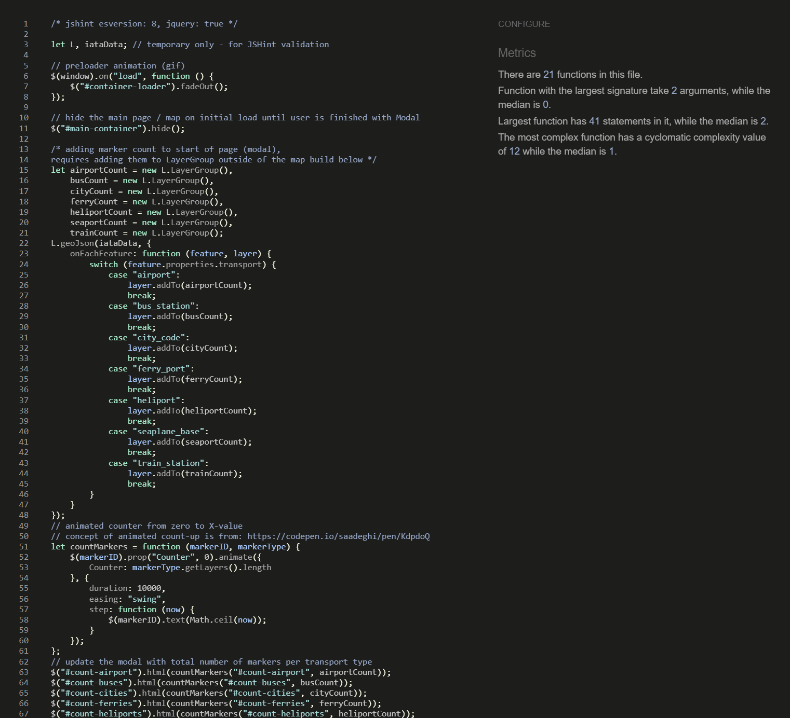

# TESTING

Return back to the [README.md](README.md).

## TEST MATRIX

I created a [testing matrix](documentation/testing/testing-ci-milestone02-ifd.xlsx) in Excel, but saved as `.png` to visualize here on GitHub. It outlines the various tests I made to ensure the site renders consistently across different platforms, and that each functionality behaves as intended. Jasmine testing was not essential for this particular project.



- [HTML Validation](https://validator.w3.org/nu/?doc=https%3A%2F%2Ftraveltimn.github.io%2Fci-milestone02-ifd%2F): No errors or warnings found.
    - 

- [CSS Validation](https://jigsaw.w3.org/css-validator/validator?uri=https%3A%2F%2Ftraveltimn.github.io%2Fci-milestone02-ifd): Property `behavior` doesn't exist. (due to leaflet.css file)
    - 

- [JavaScript Validation](http://beautifytools.com/javascript-validator.php): Leaflet `'L'` not defined in my source file.

- [JSHint (v2.9.6)](https://jshint.com/) Metrics from my `script.js` file:
    - There are **11** functions in this file.
    - Function with the largest signature take **2** arguments, while the median is **0**.
    - Largest function has **27** statements in it, while the median is **5**.
    - The most complex function has a cyclomatic complexity value of **12** while the median is **1**.
    - Three undefined variables:
        - `$` *(x35)* - used for **jQuery**
        - `L` *(x31)* - used for **LeaflefJS**
        - `iataData` *(x2)* - external variable from **iataData.js**
    - 

- [Chrome DevTools](https://developers.google.com/web/tools/chrome-devtools/):
    - *Mixed Content: The page at <[`URL`](https://traveltimn.github.io/ci-milestone02-ifd/)> was loaded over HTTPS, but requested an insecure image <[`URL`](http://services.arcgisonline.com/arcgis/rest/services/World_Imagery/MapServer/tile/3/3/4)>. This content should also be served over HTTPS.*
        - This is due to the fact that the ArcGIS layer is delivered over *HTTP* rather than *HTTPS*.

## COMPATIBILITY

To ensure a broad range of users can successfully use this site, I tested it across the 6 major browsers in both desktop and mobile configuration.

- Chrome *v.70*
- Edge *v.18*
- Firefox *v.63*
- Safari *v.12*
- Opera *v.56*
- Internet Explorer *v.11*


## NOTED ISSUES

- **Internet Explorer** is not capable of rendering CSS Grid, which causes the site to break. I don't find this too much of a problem, since use of IE has fallen to less than 7% globally as of August 2018, and all other browsers support CSS Grid natively now.

- **Esri Leaflet Geocoding** known issue when you search for a location and then try to scroll/zoom, it causes the following console error (functionality still works fine, but error still gets triggered):

```js
Uncaught TypeError: Cannot set property '_leaflet_pos' of undefined
    at wi (leaflet.js:5)
	at i._setPos (leaflet.js:5)
	at i._animateZoom (leaflet.js:5)
	at i.fire (leaflet.js:5)
	at i._animateZoom (leaflet.js:5)
	at i.<anonymous> (leaflet.js:5)
```
